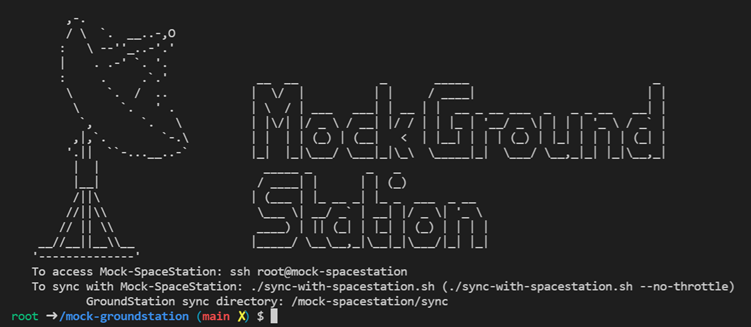
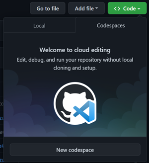
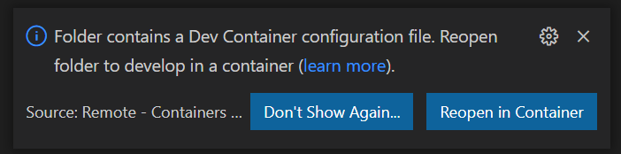
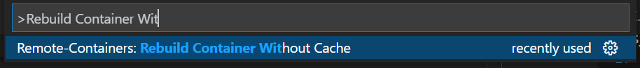
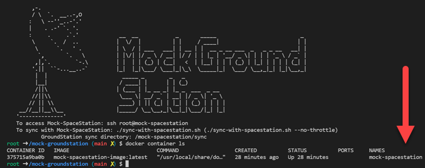
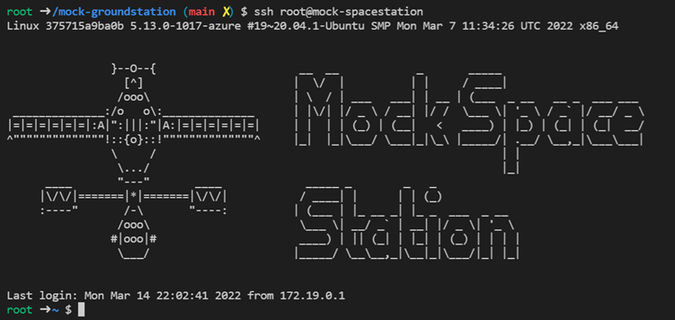
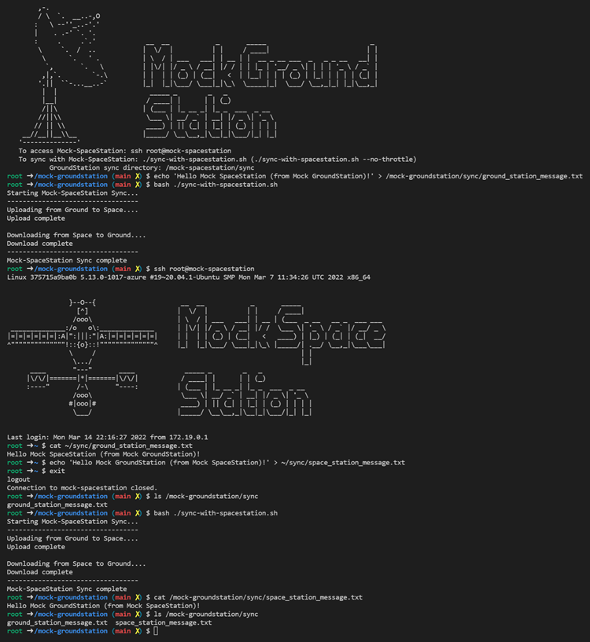

# mock-spacestation

## What is mock-spacestation?

mock-spacestation is a VSCode devContainer that deploys a Mock Spacestation and Mock Groundstation to Azure to enable developers and enthusiasts to develop and test their own workloads for space with similar constraints to those seen working with the International Space Station (ISS).

[](https://www.youtube.com/watch?v=wZfIUkcgVxI "Genomics testing on the ISS with HPE Spaceborne Computer-2 and Azure")


When deployed via VSCode or Codespaces, the main container is the **Mock Ground Station**
]


## What it simulates

1. **Latency**

    The Mock Groundstation and Mock Spacestation have network limitations and latency to simulate the speed of light latency and many international hops that communication with the ISS traverses.  Synchronizing files to/from the Mock SpaceStation is limited to 2 mb/s and 200ms of latency

1. **Connectivity Constraints**

    The Mock SpaceStation does not have any public internet access.  All packages, libraries, images, layers, etc. must be uploaded as part of the sync.  Connectivity to the Mock SpaceStation is restricted and only allowed from the Mock GroundStation

1. **Processing at The Edge and "Bursting Down" to The Cloud**

    When the Azure Space team performed their genomics experiment, they used computing power of the HPE SBC2 on-board the ISS to perform intensive work at the edge to determine what is important enough to send back to Earth, then transmitted just those important bits through the narrow 2 megabit per second pipe, then scaled up analysis and compute on a global scale with Azure.


# Getting Started

## Prerequisites
To use the Mock SpaceStation, you'll need:
1. Install [Docker Desktop](https://www.docker.com/get-started)
1. Install [VSCode](https://code.visualstudio.com/Download)
    1. Install [Remote Development](https://marketplace.visualstudio.com/items?itemName=ms-vscode-remote.vscode-remote-extensionpack) VSCode Extension
1. Clone this repo


*Alternatively* you can use Codespaces




# Running Mock GroundStation
1. Open the folder in VSCode and wait for the "Folder contains a Dev Container..." prompt.  Choose reopen in Container.

    
    - ***NOTE:*** If the prompt does not show, select F1 to open the command palette and select the *Rebuild Container Without Cache* option

        

1.	It may take a moment to build.  Just hang out...grab a fresh water...stretch...
1.  The "Mock GroundStation" banner means you're good to go!

1. The Mock GroundStation has docker (moby) configured and automatically provisions local SSH keys for interacting with the Mock SpaceStation.  The Mock SpaceStation is actually a local container with restricted network access and bandwidth limits.  You can see the companion Mock SpaceStation (container) via
```` bash
docker container ls
````



# Connecting to Mock SpaceStation
The Mock GroundStation deployment automatically builds and configures the companion Mock SpaceStation.  Docker (moby) is installed and configured to run isolated from the host's instance, as well as the SSH server.  Keys are automatically generated, deployed, and a bunch of other configuration.  The good news is that it's all automated!

Once the container opens, accessing the Mock SpaceStation is done via SSH:
```` bash
#Connect to the Mock-SpaceStation
ssh root@mock-spacestation
````


# Synchronizing Mock SpaceStation nad Mock GroundStation
A special folder on both Mock GroundStation and Mock SpaceStation called "sync" is pre-created and used to copy files between the Ground and Space Stations.  This simulates a similar process to copy files to the International Space Station, with similar network constraints

To run (from Mock GroundStation):
```` bash
bash ./sync-with-spacestation.sh
````

Full example, starting from the Mock GroundStation
From Mock GroundStation:
```` bash
#give us an output file
echo 'Hello Mock SpaceStation (from Mock GroundStation)!' > /mock-groundstation/sync/ground_station_message.txt

#sync with SpaceStation
bash ./sync-with-spacestation.sh

#Connect to the Mock SpaceStation
ssh root@mock-spacestation

#Display the file contents
cat ~/sync/ground_station_message.txt

#Update the file in space
echo 'Hello Mock GroundStation (from Mock SpaceStation)!' > ~/sync/space_station_message.txt

# disconnect from Space Station
exit

# Check contents of file - SpaceStation message NOT listed yet
ls /mock-groundstation/sync

#sync with SpaceStation
bash ./sync-with-spacestation.sh

# Check contents of file - we got SpaceStation's message!
ls /mock-groundstation/sync
cat /mock-groundstation/sync/space_station_message.txt
````



# Build your first app
*pending*