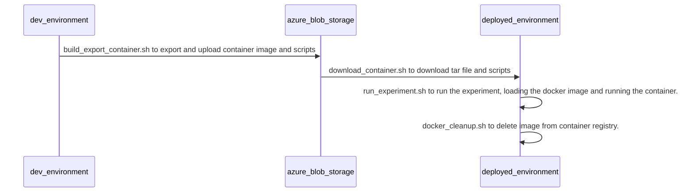

# Mock Space Station: DevOps Scripts
The following scripts are provided to make it easier to move your container application from your development environment into another environment with minimal effort.  The flow of these scripts is the following:


## build_export_container.sh
This script is responsible for exporting the docker image, and pushing the resulting tar file, as well as the other scripts to blob storage.

The script uses the following parameters:
 - **_image_name_**: The name of the docker image, and the script will by default pull the "latest" tag. 
 - **_account_name_**: The name of the storage account you want the files to be uploaded to.
 - **_account_key_**: The key of the storage account the script should use for access. 
 - **_docker_path_**: The file path of the docker file for the container to build.  

The end result of running this script is the following containers in the storage account:
- **_dockerimage_**: contains the tar file of the exported docker container.
- **_scripts_**: contains the other script files to be moved to the new environment.

A sample of the command is the following:

```bash
./build_export_container.sh --image_name "space/experimentapp" --account_name "filestorestg" --account_key "..." --docker_path "./DockerFile.ExperimentApp"
```

## download_container.sh
This script is responsible for pulling down the tar file and creating the file structure in the new environment to receive the container application.

The script uses the following parameters:
- **_image_name_**: The name of the docker image, and the script will by default pull the "latest" tag. 
 - **_account_name_**: The name of the storage account you want the files to be uploaded to.
 - **_account_key_**: The key of the storage account the script should use for access. 
 - **_download_path_**: The file path where the script should download the files to.

The results of running this script are the following:


A sample of running the command would be the following:
```bash
./download_container.sh --image_name "space/experimentapp" --account_name "filestorestg" --account_key "..." --download_path "./experiment"
```

## run_experiment.sh
This script is responsible for running the experiment in the new environment.  This will perform a couple of key steps, including loading the container image from the tar file, and then requiring a visual confirmation from the user, and then running the docker container.  

The script uses the following parameters:
- **_image_name_**: The name of the docker image, and the script will by default pull the "latest" tag. 
- **_tar_file_**: This is the file path of the tar file that you want to be loaded.

A sample of running the command would be the following:
```bash
./run_experiment.sh --image_name "space/experimentapp" --tar_file "./experiment/container.tar"
```

## docker_cleanup.sh
This script will delete your docker image from the new environment after it's completed it's execution.  

The script uses the following parameters:
- **_image_name_**: The name of the docker image, and the script will by default pull the "latest" tag. 

A sample of running the command would be the following:
```bash
./docker_cleanup.sh --image_name "space/experimentapp"
```