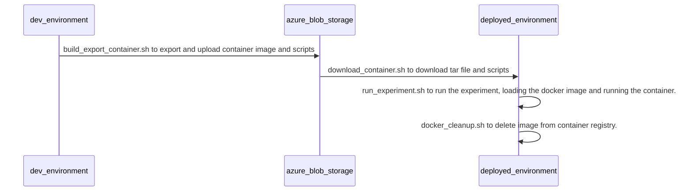

# Mock Space Station: DevOps Scripts
The following scripts are provided to make it easier to move your container application from your development environment into another environment with minimal effort.  The flow of these scripts is the following:

